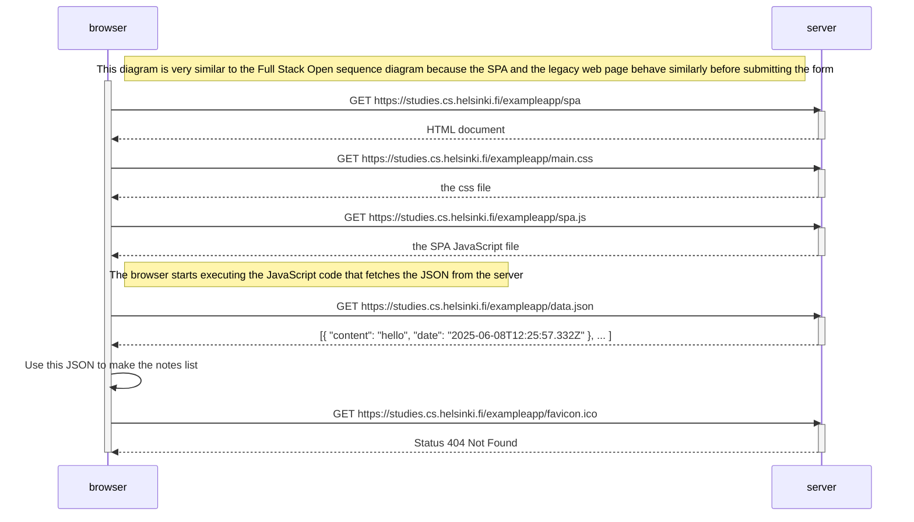

# Secuence diagram on traditional web pages
The secuence diagram reusing the code from the page

```mermaid
  sequenceDiagram
    participant browser
    participant server

    Note right of browser: This diagram is very similar to the Full Stack Open sequence diagram because the SPA and the legacy web page behave similarly before submitting the form

    activate browser
    browser->>server: GET https://studies.cs.helsinki.fi/exampleapp/spa
    activate server
    server-->>browser: HTML document
    deactivate server

    browser->>server: GET https://studies.cs.helsinki.fi/exampleapp/main.css
    activate server
    server-->>browser: the css file
    deactivate server

    browser->>server: GET https://studies.cs.helsinki.fi/exampleapp/spa.js
    activate server
    server-->>browser: the SPA JavaScript file
    deactivate server

    Note right of browser: The browser starts executing the JavaScript code that fetches the JSON from the server

    browser->>server: GET https://studies.cs.helsinki.fi/exampleapp/data.json
    activate server
    server-->>browser: [{ "content": "hello", "date": "2025-06-08T12:25:57.332Z" }, ... ]
    deactivate server

    browser->>browser: Use this JSON to make the notes list

    browser->>server: GET https://studies.cs.helsinki.fi/exampleapp/favicon.ico
    activate server
    server-->>browser: Status 404 Not Found
    deactivate server

    deactivate browser
```